# EasyNR10 v2 — Documento de Projeto

> Projeto de refatoração completa do EasyNR10. Complementa a [`ANALISE-EASYNR10.md`](./ANALISE-EASYNR10.md), que registra o diagnóstico do sistema atual e a justificativa das escolhas de stack.
>
> **Versão:** 0.1 · **Data:** 02/07/2026 · **Status:** rascunho para validação

---

## 1. Descrição

O **EasyNR10 v2** é a reescrita da plataforma de gestão de conformidade com a **NR-10** usada pela PSO Engenharia para atender múltiplas empresas clientes. A plataforma organiza, por **empresa → unidade**:

- o **PIE (Prontuário de Instalações Elétricas)** — a gestão de documentos exigida pela norma: árvore de pastas padronizada, arquivos com validade, versionamento e avisos de vencimento;
- a **avaliação de conformidade** — diagnósticos dos itens de adequação da unidade frente aos requisitos da NR-10, com evidências e parecer técnico;
- o **plano de ação** derivado das não conformidades;
- **dashboards** e uma seção de **relatórios analíticos** exportáveis em PDF e CSV.

A v2 parte do modelo de domínio já validado pelo sistema atual e do fluxo de usuário prototipado no `client-test` (navegação orientada a URL: empresas → unidades → unidade → PIE), reescrevendo frontend e backend sobre uma stack unificada em TypeScript.

## 2. Objetivo

### Objetivo geral

Entregar uma plataforma multi-tenant de gestão de conformidade NR-10 que substitua integralmente o sistema atual, com o mesmo domínio funcional, melhor experiência de uso e uma base de código sustentável (tipada ponta a ponta, testada e sem as dívidas estruturais mapeadas na análise).

### Objetivos específicos

| # | Objetivo | Métrica de sucesso |
|---|---|---|
| O1 | Reescrever o frontend sobre o fluxo do `client-test` | 100% das telas navegáveis por URL; ≤ 3 stores globais |
| O2 | Contrato tipado ponta a ponta (banco → tela) | Zero DTOs duplicados entre front e back |
| O3 | Isolamento multi-tenant garantido no servidor | Teste automatizado de acesso cruzado entre tenants passando |
| O4 | Qualidade desde o início | Cobertura de testes nas regras de conformidade; e2e dos fluxos críticos em CI |
| O5 | Segurança corrigida | Zero segredos no repositório; upload via presigned URL |
| O6 | Migração sem perda de dados | Dados e arquivos do sistema atual migrados e conferidos em staging |

## 3. Escopo

**Dentro do escopo (v2.0):** autenticação (e-mail/senha + Google), gestão de empresas/unidades/usuários, PIE completo, catálogo de normas e requisitos, itens de adequação, diagnósticos com evidências, plano de ação, dashboards, seção de relatórios com exportação PDF/CSV, notificações in-app e por e-mail, importação por planilha, migração dos dados atuais.

**Fora do escopo (backlog):** API pública para terceiros, aplicativo móvel, outras NRs além da NR-10 (a modelagem por `Norm` deixa a porta aberta), assinatura digital de documentos, SSO corporativo (SAML).

## 4. Atores

| Ator | Descrição |
|---|---|
| **Admin (consultor PSO)** | Gerencia empresas, unidades, usuários, catálogo de normas e esquemas de pastas; executa diagnósticos e emite pareceres técnicos |
| **Cliente (gestor da unidade)** | Acessa as unidades às quais pertence; consulta o PIE, envia documentos, acompanha plano de ação, dashboards e relatórios |
| **Sistema (agendador)** | Verifica vencimentos de documentos e prazos do plano de ação; dispara notificações in-app e e-mails |

### 4.1 Diagrama de casos de uso

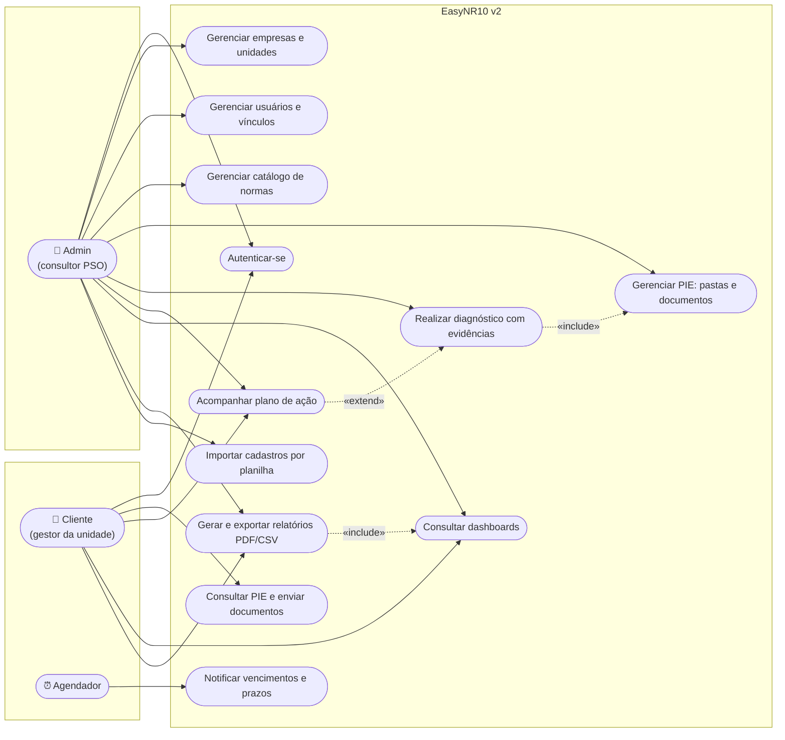

## 5. Requisitos

### 5.1 Requisitos funcionais

Prioridade MoSCoW: **M** (must) · **S** (should) · **C** (could).

**Autenticação e acesso**
| ID | Requisito | Prior. |
|---|---|---|
| RF01 | Login com e-mail/senha e com Google (OAuth2); sessão gerenciada pelo better-auth | M |
| RF02 | Recuperação de senha por e-mail | M |
| RF03 | Perfis de acesso (admin, cliente) com permissões distintas, aplicadas no servidor | M |
| RF04 | Vínculo de usuários a unidades; usuário só enxerga empresas/unidades às quais pertence | M |

**Estrutura organizacional**
| ID | Requisito | Prior. |
|---|---|---|
| RF05 | CRUD de empresas | M |
| RF06 | CRUD de unidades por empresa, com logo e configuração de e-mail | M |
| RF07 | Navegação por contexto empresa/unidade com a URL como fonte da verdade | M |

**PIE — Prontuário de Instalações Elétricas**
| ID | Requisito | Prior. |
|---|---|---|
| RF08 | Árvore de pastas por unidade a partir de esquemas padrão reaproveitáveis | M |
| RF09 | Upload/download de documentos via presigned URL (S3) | M |
| RF09.1 | Todo novo upload sobre um documento existente cria uma **nova versão**, preservando as anteriores (histórico imutável) | M |
| RF09.2 | Histórico de versões consultável: número, autor, data/hora e tamanho de cada versão | M |
| RF09.3 | Download de qualquer versão anterior | M |
| RF09.4 | Restaurar uma versão anterior — a restauração cria uma nova versão apontando para o conteúdo antigo (nunca sobrescreve o histórico) | S |
| RF10 | Validade de documentos: data de expiração e antecedência de aviso configurável | M |
| RF11 | Documentos referenciados vinculados a grupos documentais exigidos pela norma | S |

**Normas e conformidade**
| ID | Requisito | Prior. |
|---|---|---|
| RF12 | Catálogo de normas/requisitos com peso de importância e grupo documental | M |
| RF13 | Itens de adequação por unidade × norma, ativáveis/desativáveis | M |
| RF13.1 | Configuração de **requisitos de evidência** por item de adequação: tipo (`documento`, `parecer`, `grupo`), pergunta, grupo de cadastro vinculado (quando tipo grupo) e documento padrão de referência | M |
| RF14 | Diagnóstico por item: status, prazo, responsável, ação recomendada, parecer técnico, autor | M |
| RF15 | Evidências estruturadas por requisito no diagnóstico: tipo `documento` vincula um documento do PIE; tipo `parecer` registra resposta textual; tipo `grupo` **expande os itens do grupo** (ex.: a lista de colaboradores) exigindo um documento de evidência por item | M |
| RF15.1 | Sugestão automática de documento por item do grupo — busca na pasta do item no PIE por nome de arquivo — com vínculo manual como alternativa/correção | M |
| RF16 | Plano de ação consolidado das não conformidades (diagnósticos com aderência abaixo de `conforme`), com acompanhamento de prazos | M |
| RF17 | Importação de cadastros por planilha (Excel/CSV) | S |

**Cadastros auxiliares**
| ID | Requisito | Prior. |
|---|---|---|
| RF18 | **Módulo genérico de grupos de cadastro** por unidade (grupo → itens, com metadados livres e pasta correspondente no PIE por item) — base do motor de evidências tipo grupo, preservado do sistema atual | M |
| RF18.1 | Módulos especializados de **Colaboradores** e **Equipamentos** com **entidades próprias no banco** (`employee`, `equipment`) e telas/campos dedicados, cada registro ligado 1:1 a um item da base genérica de grupos — participando do motor de evidências e das pastas do PIE como qualquer item | S |
| RF18.2 | Equipamentos classificados por **tipo** (`equipamento elétrico`, `ferramenta`, `EPI`, `EPC`), com campos específicos por tipo evolutivos (ex.: CA e validade para EPI, calibração para ferramenta) | S |
| RF18.3 | **Configuração da pasta do item no PIE feita na própria tela do módulo** (colaboradores, equipamentos ou grupo genérico): ao criar o item o sistema sugere criar uma subpasta com o nome dele sob a pasta-raiz do grupo, e o usuário pode aceitar ou apontar para outra pasta existente; a pasta pode ser trocada depois na mesma tela | M |

**Visualização e relatórios**
| ID | Requisito | Prior. |
|---|---|---|
| RF19 | Dashboard geral de conformidade por empresa/unidade | M |
| RF20 | Painéis por categoria (colaboradores, equipamentos, instalações, procedimentos) | S |
| RF21 | Seção de relatórios analíticos (ex.: Relatório de Não Conformidades, situação documental do PIE, pendências do plano de ação) | M |
| RF22 | Exportação de qualquer relatório em PDF (apresentação) e CSV (dados) | M |

**Notificações**
| ID | Requisito | Prior. |
|---|---|---|
| RF23 | Notificações in-app por usuário (lida/não lida, ativar/desativar) | S |
| RF24 | E-mails de vencimento de documento e prazo de ação, via agendador | M |

### 5.2 Requisitos não funcionais

| ID | Categoria | Requisito |
|---|---|---|
| RNF01 | Segurança | Hash bcrypt/argon2, sessões seguras, Helmet, rate limiting, validação Zod estrita; nenhum segredo em repositório |
| RNF02 | Multi-tenancy | Toda query filtrada pelo contexto autorizado (middleware de tenant no tRPC); RLS no Postgres como segunda defesa |
| RNF03 | Auditoria/LGPD | Soft-delete, `created_at`/`updated_at` e autoria em entidades de negócio; trilha de alterações em diagnósticos e pareceres |
| RNF04 | Desempenho | Listagens paginadas no servidor; agregações no banco; tabelas virtualizadas; p95 de API < 300 ms nas consultas usuais |
| RNF05 | Upload | Arquivos direto ao S3 (presigned); API sem tráfego de binário |
| RNF06 | Testabilidade | Unit (Vitest — mesmo runtime Node da produção e mesmo pipeline Vite do front) nas regras de conformidade e autorização; e2e (Playwright) nos fluxos críticos; tudo em CI |
| RNF07 | Observabilidade | Logs estruturados (pino) + OpenTelemetry; dashboards de infra somente quando houver produção |
| RNF08 | Reprodutibilidade | Monorepo Bun com lockfile único; Docker multi-stage; seed de dev automática |
| RNF09 | Disponibilidade | Backup automatizado do Postgres e do bucket; migrations Drizzle como único mecanismo de mudança de schema |
| RNF10 | Usabilidade | pt-BR, responsivo, URLs compartilháveis |
| RNF11 | Manutenibilidade | Identificadores em inglês / UI em pt-BR; componentes pequenos; oxlint + prettier em CI |

## 6. Arquitetura

### 6.1 Visão de containers

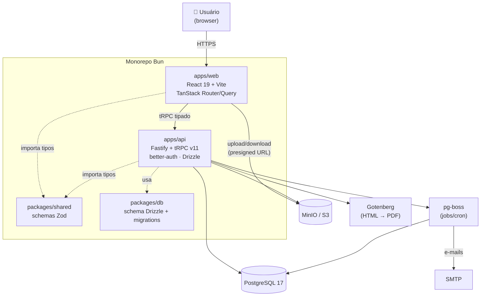

### 6.2 Navegação (fluxo do `client-test`)

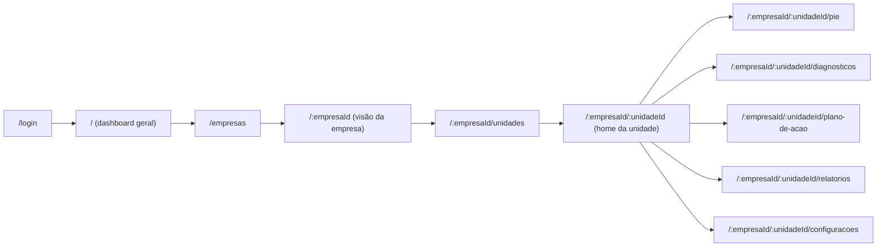

## 7. Modelo de domínio

### 7.1 Diagrama de classes (domínio)

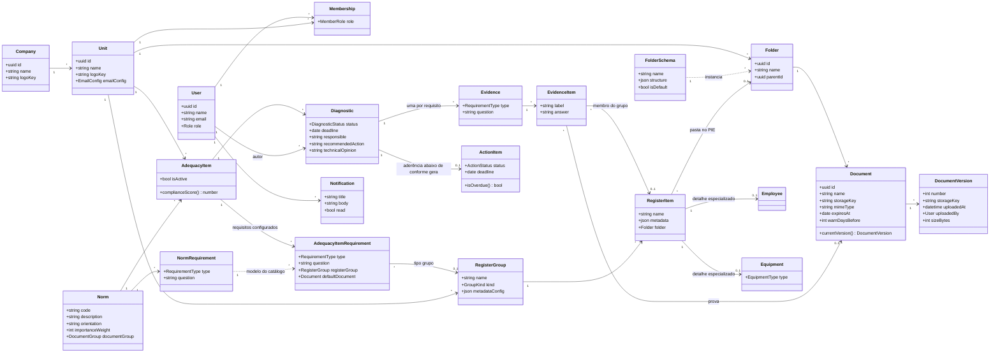

### 7.2 Diagrama entidade-relacionamento (persistência)

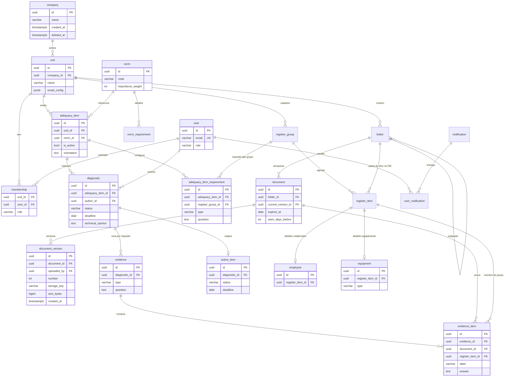

### 7.3 Dicionário de dados

Convenções gerais:

- **PK** = chave primária · **FK** = chave estrangeira · **UK** = única · **NN** = obrigatório.
- Todas as tabelas de negócio possuem as **colunas de auditoria**: `created_at timestamptz NN default now()`, `updated_at timestamptz NN` e `deleted_at timestamptz` (soft-delete; `NULL` = ativo). Elas são omitidas dos quadros abaixo.
- Identificadores são `uuid` gerados pela aplicação (v7, ordenável por tempo).

#### Tipos enumerados

| Enum | Valores | Uso |
|---|---|---|
| `user_role` | `admin`, `client` | Papel global do usuário |
| `member_role` | `manager`, `viewer` | Papel do usuário dentro da unidade |
| `diagnostic_status` | `insuficiente`, `parcial`, `suficiente`, `conforme` | Aderência do item à norma no diagnóstico (seção 7.4). Item **sem diagnóstico** = "sem avaliação" (ausência de registro, não um valor do enum); item fora de escopo usa `adequacy_item.is_active = false` |
| `action_status` | `pendente`, `em_andamento`, `concluida`, `cancelada` | Situação da ação do plano |
| `requirement_type` | `document`, `opinion`, `group` | Tipo do requisito de evidência (documento único, parecer textual, ou expansão de grupo de cadastro) |
| `group_kind` | `custom`, `colaboradores`, `equipamentos` | Natureza do grupo de cadastro: genérico (RF18) ou especializado (RF18.1) |
| `equipment_type` | `eletrico`, `ferramenta`, `epi`, `epc` | Tipo do equipamento (RF18.2) |
| `document_group` | `instalacoes`, `instrucoes_e_procedimentos`, `colaboradores`, `equipamentos` | Grupos documentais do prontuário (herdados do sistema atual); classificam normas, documentos e o catálogo de documentos padrão |

#### `company` — empresa cliente

| Coluna | Tipo | Restrições | Descrição |
|---|---|---|---|
| `id` | uuid | PK | Identificador |
| `name` | varchar(255) | NN, UK | Razão social / nome da empresa |
| `logo_key` | varchar(512) | | Chave do logotipo no S3 |

#### `unit` — unidade da empresa

| Coluna | Tipo | Restrições | Descrição |
|---|---|---|---|
| `id` | uuid | PK | Identificador |
| `company_id` | uuid | FK → company, NN | Empresa à qual a unidade pertence |
| `name` | varchar(255) | NN, UK (company_id, name) | Nome da unidade |
| `logo_key` | varchar(512) | | Chave do logotipo no S3 |
| `email_config` | jsonb | | Configuração SMTP própria (host, porta, remetente; credenciais no secret manager) |

#### `user` — usuário do sistema

| Coluna | Tipo | Restrições | Descrição |
|---|---|---|---|
| `id` | uuid | PK | Identificador |
| `name` | varchar(255) | NN | Nome de exibição |
| `email` | varchar(255) | NN, UK | E-mail de login |
| `role` | user_role | NN, default `client` | Papel global |
| `notifications_enabled` | bool | NN, default `true` | Preferência de recebimento de notificações |

> Credenciais (hash de senha, contas Google, sessões, tokens de reset) ficam nas tabelas gerenciadas pelo **better-auth**, fora deste dicionário.

#### `membership` — vínculo usuário × unidade

| Coluna | Tipo | Restrições | Descrição |
|---|---|---|---|
| `unit_id` | uuid | PK, FK → unit | Unidade |
| `user_id` | uuid | PK, FK → user | Usuário |
| `role` | member_role | NN, default `viewer` | Papel do usuário na unidade |

#### `folder_schema` — esquema padrão de pastas

| Coluna | Tipo | Restrições | Descrição |
|---|---|---|---|
| `id` | uuid | PK | Identificador |
| `name` | varchar(255) | NN | Nome do esquema |
| `structure` | jsonb | NN | Árvore de pastas do modelo |
| `is_default` | bool | NN, default `false` | Aplicado automaticamente a unidades novas |

#### `folder` — pasta do PIE

| Coluna | Tipo | Restrições | Descrição |
|---|---|---|---|
| `id` | uuid | PK | Identificador |
| `unit_id` | uuid | FK → unit, NN | Unidade dona da pasta |
| `parent_id` | uuid | FK → folder | Pasta pai (`NULL` = raiz do prontuário) |
| `name` | varchar(255) | NN, UK (unit_id, parent_id, name) | Nome da pasta |
| `schema_id` | uuid | FK → folder_schema | Esquema que originou a pasta, se houver |

#### `document` — documento do PIE (registro lógico)

| Coluna | Tipo | Restrições | Descrição |
|---|---|---|---|
| `id` | uuid | PK | Identificador |
| `folder_id` | uuid | FK → folder, NN | Pasta onde o documento está |
| `current_version_id` | uuid | FK → document_version | Versão corrente (RF09.1) |
| `name` | varchar(255) | NN | Nome de exibição |
| `document_group` | document_group | | Grupo documental exigido pela norma (RF11) |
| `expires_at` | date | | Data de vencimento (`NULL` = não expira) |
| `warn_days_before` | int | | Antecedência do aviso de vencimento, em dias |

#### `document_version` — versão de documento (conteúdo)

| Coluna | Tipo | Restrições | Descrição |
|---|---|---|---|
| `id` | uuid | PK | Identificador |
| `document_id` | uuid | FK → document, NN | Documento lógico |
| `number` | int | NN, UK (document_id, number) | Número sequencial da versão |
| `storage_key` | varchar(512) | NN | Chave do objeto no S3 |
| `mime_type` | varchar(255) | NN | Tipo do arquivo |
| `size_bytes` | bigint | NN | Tamanho do arquivo |
| `uploaded_by` | uuid | FK → user, NN | Autor do upload |

> Versões são **imutáveis**: sem `updated_at`/`deleted_at`; restauração cria versão nova (seção 7.5).

#### `default_document` — catálogo de documentos padrão (RF11)

| Coluna | Tipo | Restrições | Descrição |
|---|---|---|---|
| `id` | uuid | PK | Identificador |
| `name` | varchar(255) | NN, UK (name, document_group) entre ativos | Nome padrão do documento (ex.: "Diagrama Unifilar - *", "Certificado Treinamento NR10 Básico") |
| `document_group` | document_group | NN | Grupo documental |
| `is_optional` | bool | NN, default `false` | Documento opcional no prontuário |

> Catálogo **global** portado do seed do sistema legado (30 nomes únicos: 12 Instalações, 7 Instruções e Procedimentos, 6 Colaboradores, 5 Equipamentos). Convenção de nome: o sufixo `" - *"` indica documento **por item** — o `*` é substituído pelo nome do alvo (ex.: "Certificado de Aprovação (CA) - Luva Isolante"). É a base dos documentos referenciados e da sugestão de nomes no upload do PIE.

#### `norm` — norma / requisito da NR-10 (catálogo global)

| Coluna | Tipo | Restrições | Descrição |
|---|---|---|---|
| `id` | uuid | PK | Identificador |
| `code` | varchar(50) | NN, UK | Código do item da norma (ex.: `10.2.4`) |
| `description` | text | NN | Texto do requisito |
| `orientation` | text | NN | Orientação de adequação |
| `importance_weight` | int | NN | Peso no cálculo de conformidade |
| `document_group` | document_group | | Grupo documental associado |

#### `norm_requirement` — requisito de evidência do catálogo (modelo)

| Coluna | Tipo | Restrições | Descrição |
|---|---|---|---|
| `id` | uuid | PK | Identificador |
| `norm_id` | uuid | FK → norm, NN | Norma pai |
| `type` | requirement_type | NN | Tipo de evidência esperada |
| `question` | text | NN | Pergunta/exigência do requisito |

#### `adequacy_item` — item de adequação (norma aplicada à unidade)

| Coluna | Tipo | Restrições | Descrição |
|---|---|---|---|
| `id` | uuid | PK | Identificador |
| `unit_id` | uuid | FK → unit, NN, UK (unit_id, norm_id) | Unidade avaliada |
| `norm_id` | uuid | FK → norm, NN | Norma aplicada |
| `is_active` | bool | NN, default `true` | Item considerado na avaliação da unidade |
| `orientation` | text | | Orientação específica da unidade (complementa a do catálogo) |

#### `adequacy_item_requirement` — requisito de evidência configurado no item (RF13.1)

| Coluna | Tipo | Restrições | Descrição |
|---|---|---|---|
| `id` | uuid | PK | Identificador |
| `adequacy_item_id` | uuid | FK → adequacy_item, NN | Item de adequação configurado |
| `type` | requirement_type | NN | Tipo de evidência exigida |
| `question` | text | NN | Pergunta/exigência (herdada do catálogo, editável por unidade) |
| `register_group_id` | uuid | FK → register_group | Grupo de cadastro expandido na evidência (obrigatório quando `type = group`) |
| `default_document_id` | uuid | FK → default_document | Nome de documento padrão usado como termo de busca na sugestão automática (requisitos `group`) |

#### `diagnostic` — diagnóstico de um item de adequação

| Coluna | Tipo | Restrições | Descrição |
|---|---|---|---|
| `id` | uuid | PK | Identificador |
| `adequacy_item_id` | uuid | FK → adequacy_item, NN | Item avaliado |
| `author_id` | uuid | FK → user, NN | Consultor que avaliou |
| `status` | diagnostic_status | NN | Resultado da avaliação |
| `deadline` | date | | Prazo para adequação |
| `responsible` | varchar(255) | | Responsável pela ação na unidade |
| `recommended_action` | text | | Ação recomendada |
| `technical_opinion` | text | | Parecer técnico |

#### `evidence` — evidência do diagnóstico (snapshot do requisito)

| Coluna | Tipo | Restrições | Descrição |
|---|---|---|---|
| `id` | uuid | PK | Identificador |
| `diagnostic_id` | uuid | FK → diagnostic, NN | Diagnóstico comprovado |
| `type` | requirement_type | NN | Tipo do requisito **no momento do diagnóstico** |
| `question` | text | NN | Pergunta do requisito no momento do diagnóstico |

> `type` e `question` são copiados do requisito (snapshot): alterar a configuração do item depois **não** reescreve diagnósticos já realizados.

#### `evidence_item` — item da evidência

| Coluna | Tipo | Restrições | Descrição |
|---|---|---|---|
| `id` | uuid | PK | Identificador |
| `evidence_id` | uuid | FK → evidence, NN | Evidência composta |
| `register_item_id` | uuid | FK → register_item | Membro do grupo comprovado (ex.: o colaborador) — preenchido quando o requisito é tipo `group` |
| `document_id` | uuid | FK → document | Documento do PIE usado como prova (sugerido automaticamente ou vinculado manualmente — RF15.1) |
| `label` | varchar(512) | NN | Rótulo exibido (ex.: "ASO de João Silva") |
| `answer` | text | | Resposta textual (requisitos tipo `opinion`) ou nome do arquivo vinculado |

#### `action_item` — ação do plano de ação

| Coluna | Tipo | Restrições | Descrição |
|---|---|---|---|
| `id` | uuid | PK | Identificador |
| `diagnostic_id` | uuid | FK → diagnostic, NN, UK | Não conformidade de origem |
| `status` | action_status | NN, default `pendente` | Situação da ação |
| `deadline` | date | NN | Prazo de conclusão |
| `completed_at` | timestamptz | | Data de conclusão efetiva |

#### `notification` / `user_notification` — notificações

| Coluna | Tipo | Restrições | Descrição |
|---|---|---|---|
| `notification.id` | uuid | PK | Identificador |
| `notification.unit_id` | uuid | FK → unit | Unidade de contexto |
| `notification.title` | varchar(255) | NN | Título |
| `notification.body` | text | NN | Conteúdo |
| `user_notification.notification_id` | uuid | PK, FK → notification | Notificação entregue |
| `user_notification.user_id` | uuid | PK, FK → user | Destinatário |
| `user_notification.read_at` | timestamptz | | Momento da leitura (`NULL` = não lida) |

#### `register_group` — grupo de cadastro (RF18, base do motor de evidências)

| Coluna | Tipo | Restrições | Descrição |
|---|---|---|---|
| `id` | uuid | PK | Identificador |
| `unit_id` | uuid | FK → unit, NN | Unidade dona do cadastro |
| `name` | varchar(255) | NN, UK (unit_id, name) | Nome do grupo (ex.: Colaboradores, Extintores) |
| `kind` | group_kind | NN, default `custom` | `custom` = grupo genérico; `colaboradores`/`equipamentos` = grupos dos módulos especializados (RF18.1), que ganham telas e campos próprios mas participam do motor de evidências como qualquer grupo |
| `metadata_config` | jsonb | | Definição dos campos extras dos itens deste grupo |
| `folder_id` | uuid | FK → folder | Pasta-raiz do grupo no PIE (cada item ganha subpasta) |

#### `register_item` — item de cadastro (membro do grupo)

| Coluna | Tipo | Restrições | Descrição |
|---|---|---|---|
| `id` | uuid | PK | Identificador |
| `group_id` | uuid | FK → register_group, NN | Grupo pai |
| `name` | varchar(255) | NN, UK (group_id, name) entre ativos | Nome do item (ex.: o colaborador) |
| `folder_id` | uuid | FK → folder | Pasta do item no PIE — onde a busca automática de evidência procura os documentos (RF15.1). Configurada na tela do módulo dono do item (RF18.3): sugerida como subpasta da pasta-raiz do grupo, aceitável ou substituível por outra pasta |
| `metadata` | jsonb | | Valores dos campos definidos em `metadata_config` |

#### `employee` — colaborador (RF18.1, detalhe especializado)

| Coluna | Tipo | Restrições | Descrição |
|---|---|---|---|
| `id` | uuid | PK | Identificador |
| `register_item_id` | uuid | FK → register_item, NN, UK | Item de cadastro correspondente (1:1) — dá ao colaborador nome de exibição, pasta no PIE e participação no motor de evidências |

#### `equipment` — equipamento (RF18.1/RF18.2, detalhe especializado)

| Coluna | Tipo | Restrições | Descrição |
|---|---|---|---|
| `id` | uuid | PK | Identificador |
| `register_item_id` | uuid | FK → register_item, NN, UK | Item de cadastro correspondente (1:1) — mesma ponte do colaborador |
| `type` | equipment_type | NN | Tipo: `eletrico`, `ferramenta`, `epi`, `epc` |

> **Colunas de domínio serão adicionadas quando a necessidade aparecer** (via migration Drizzle). Para campos específicos por tipo de equipamento (RF18.2), a estratégia é: campos ainda instáveis podem nascer em jsonb validado por Zod; ao se estabilizarem ou precisarem de índice/constraint/relatório, viram coluna ou tabela de extensão 1:1 por tipo (`equipment_epi`, …).

### 7.4 Estados do diagnóstico

A escala de **aderência** tem quatro níveis: `insuficiente` → `parcial` → `suficiente` → `conforme`. Cada diagnóstico registra o nível avaliado; o nível atual do item é o do diagnóstico mais recente. Diagnósticos abaixo de `conforme` podem gerar ação no plano; a reavaliação (novo diagnóstico) move o item na escala em qualquer direção.

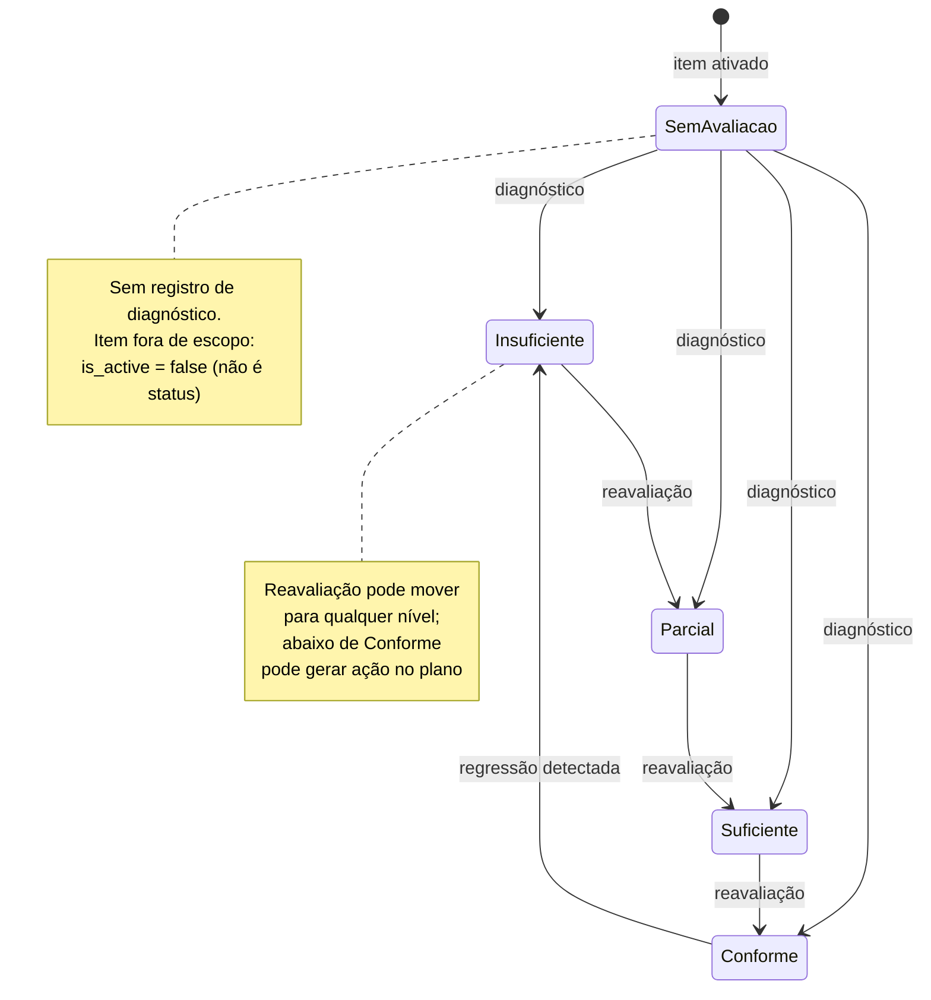

### 7.5 Versionamento de documentos

Regras do modelo (RF09.1–RF09.4):

1. **`Document` é o registro lógico; `DocumentVersion` é o conteúdo.** O documento aponta para a versão corrente (`current_version_id`); cada versão guarda seu próprio `storage_key` no S3, autor, tamanho e data.
2. **Histórico imutável**: versões nunca são sobrescritas nem apagadas — um novo upload cria a versão `n+1` e move o ponteiro de versão corrente. O bucket opera com versionamento habilitado como redundância.
3. **Restaurar = criar versão nova**: restaurar a versão `k` gera a versão `n+1` reutilizando o `storage_key` de `k`. O histórico conta a história completa, inclusive a restauração (importante para auditoria de conformidade).
4. **Metadados ficam no documento, conteúdo na versão**: validade (`expires_at`), pasta e vínculos com evidências pertencem ao `Document` — trocar a versão não quebra evidências de diagnósticos nem os avisos de vencimento.
5. **Exclusão é soft-delete do `Document`** (o prontuário é registro legal); as versões e objetos no S3 são retidos conforme política de retenção.

### 7.6 Motor de evidências (requisitos → evidências estruturadas)

Mecanismo herdado do sistema atual e **preservado na v2** (RF13.1, RF15, RF15.1, RF18):

1. **Configuração**: cada item de adequação recebe requisitos de evidência (`adequacy_item_requirement`), criados a partir dos modelos do catálogo (`norm_requirement`) e ajustáveis por unidade. Cada requisito tem um tipo:
   - `document` — exige um documento do PIE;
   - `opinion` — exige uma resposta/parecer textual;
   - `group` — aponta para um **grupo de cadastro** da unidade.
2. **Execução (diagnóstico)**: cada requisito vira uma `evidence` no diagnóstico. Para requisitos tipo `group`, o sistema **expande os itens do grupo** — ex.: um requisito "ASO" sobre o grupo Colaboradores gera um `evidence_item` por colaborador ("ASO de João Silva", "ASO de Maria…"), cada um exigindo um documento como prova.
3. **Sugestão automática**: como cada item de cadastro tem sua **pasta no PIE** (`register_item.folder_id`), o sistema sugere o documento buscando na pasta do item por nome de arquivo; o consultor confirma ou vincula manualmente (RF15.1). A pasta do item é **configurada na tela do próprio módulo** (RF18.3): colaborador e equipamento não têm vínculo direto com pasta — herdam a do `register_item` que os representa, então o motor de evidências não precisa saber se o item é genérico ou especializado.
4. **Snapshot**: a evidência copia tipo e pergunta do requisito no momento do diagnóstico — reconfigurar o item não altera diagnósticos passados (auditoria).
5. **Genérico vs. especializado**: o **módulo genérico de grupos permanece** como a base do motor (qualquer grupo criado pelo usuário pode ser alvo de requisito tipo `group`). Os módulos especializados de **Colaboradores** e **Equipamentos** (RF18.1) têm **entidades próprias no banco** (`employee`, `equipment`) com telas, campos e validações dedicadas — mas cada registro é ligado 1:1 a um `register_item` de um grupo com `kind` correspondente. Para o motor de evidências e para as pastas do PIE, colaboradores e equipamentos são itens de grupo como quaisquer outros: nenhum caminho do código trata evidência de colaborador diferente de evidência de grupo custom.
6. **Tipos de equipamento** (RF18.2): `equipment.type` classifica em `eletrico`, `ferramenta`, `epi`, `epc`. As entidades especializadas nascem só com o essencial (ponte + tipo); colunas de domínio entram quando a necessidade aparecer, seguindo a estratégia de evolução registrada na seção 7.3.

## 8. Diagramas de sequência

### 8.1 Upload de documento no PIE (presigned URL)

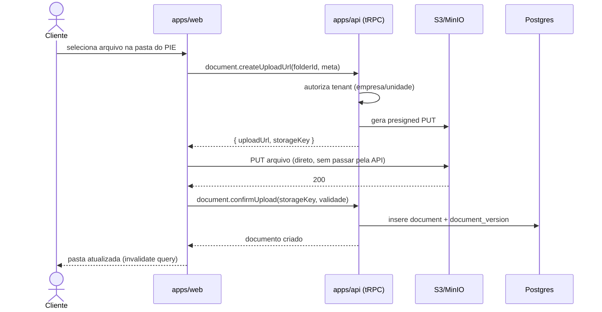

### 8.2 Nova versão e restauração de documento

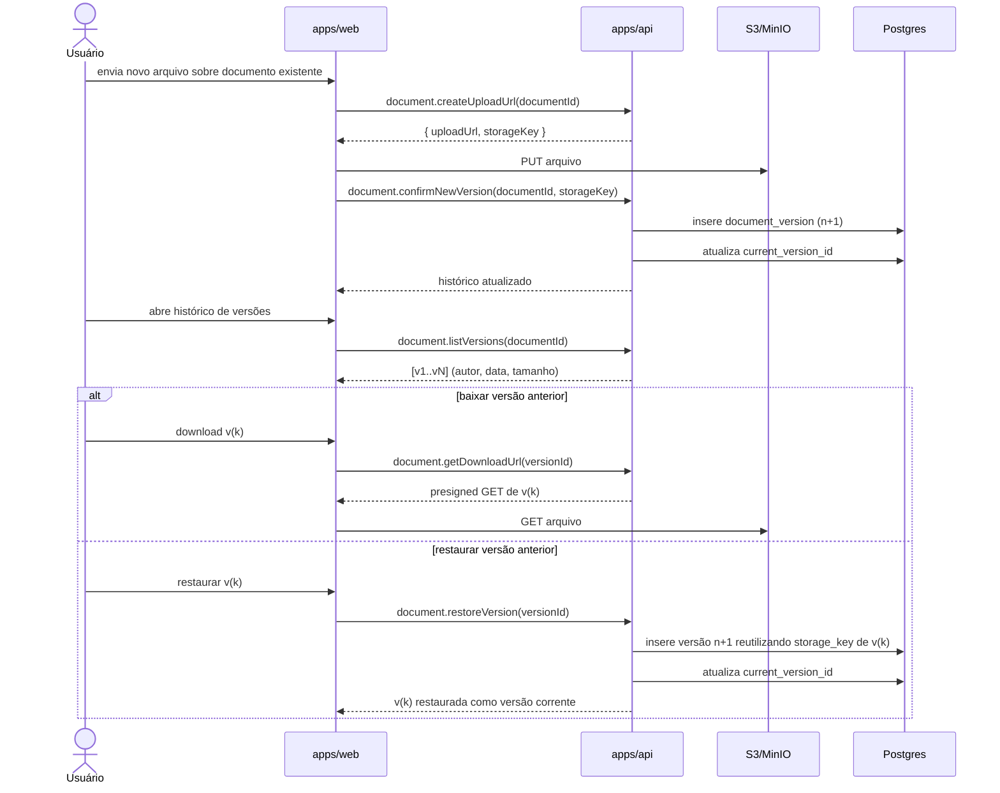

### 8.3 Diagnóstico e plano de ação

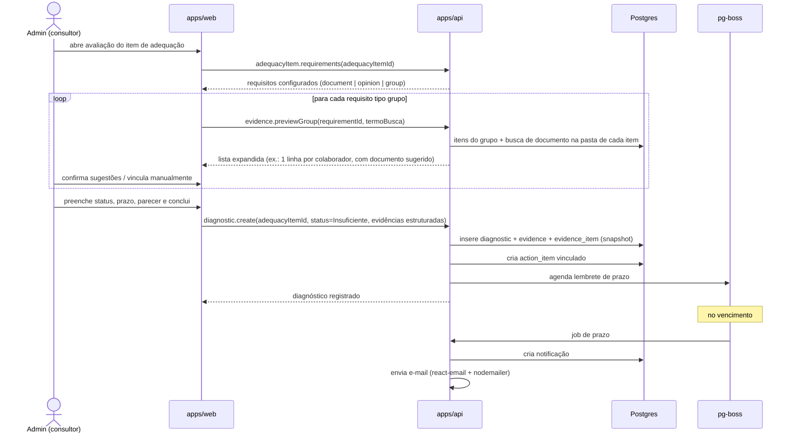

### 8.4 Relatório analítico com exportação

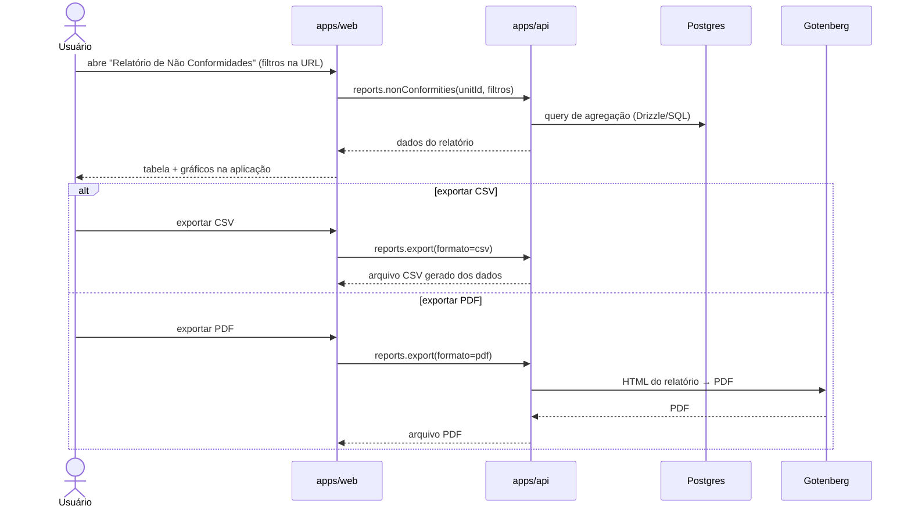

## 9. Implantação

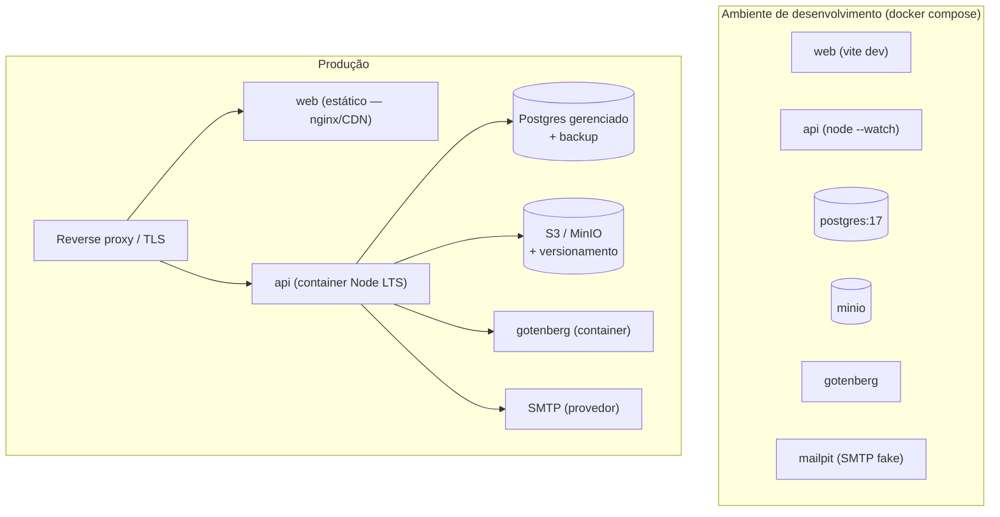

- **CI (GitHub Actions):** lint (oxlint) → typecheck → unit (Vitest) → e2e (Playwright) → build das imagens.
- **Segredos:** `.env` gitignored em dev; secret manager em produção.
- **Migração de schema:** exclusivamente via migrations Drizzle, aplicadas no deploy.

## 10. Plano de entrega

| Fase | Entrega | Conteúdo | Critério de saída |
|---|---|---|---|
| F0 | Fundação | Monorepo Bun, CI, auth (better-auth + organizations), contexto de tenant, esqueleto de navegação | Login + troca de contexto empresa/unidade funcionando com teste e2e |
| F1 | Núcleo organizacional | Empresas, unidades, usuários/vínculos, importação por planilha | RF05–RF07, RF17 aceitos |
| F2 | PIE | Pastas por esquema, upload presigned, versões, validade | RF08–RF11 aceitos; e2e de upload |
| F3 | Conformidade | Normas, itens de adequação, diagnósticos, evidências, plano de ação | RF12–RF16 aceitos; unit tests das regras de score |
| F4 | Visualização | Dashboards, seção de relatórios, exportação PDF/CSV | RF19–RF22 aceitos |
| F5 | Notificações | In-app + e-mail agendado (pg-boss) | RF23–RF24 aceitos |
| F6 | Migração e cutover | Script Postgres→Postgres + cópia do bucket, staging, somente-leitura no legado, virada | O6 aceito; legado desligado |

## 11. Riscos

| Risco | Prob. | Impacto | Mitigação |
|---|---|---|---|
| Segredos já expostos no repositório legado serem explorados | Alta | Alto | Revogar/rotacionar imediatamente (independe da v2) |
| Regras de negócio implícitas no código legado (sem testes) se perderem na reescrita | Média | Alto | Levantamento por módulo antes de cada fase; validação com usuários da PSO a cada entrega |
| Divergência de dados na migração (typos de schema, soft-deletes) | Média | Médio | Script de migração idempotente + relatório de conferência rodado em staging |
| Escopo crescer durante a reescrita ("já que estamos mexendo...") | Alta | Médio | Backlog separado da v2.0; fases fechadas por critério de saída |
| better-auth/tRPC serem novidade para a equipe | Baixa | Médio | F0 concentra o aprendizado; padrões documentados no repositório |

## 12. Critérios de aceite gerais (Definition of Done)

1. Requisito implementado com autorização de tenant verificada no servidor.
2. Testes: unit para regra de negócio nova; e2e quando o fluxo é crítico (login, upload, diagnóstico, exportação).
3. Lint + typecheck limpos em CI.
4. UI em pt-BR, navegável por URL, responsiva.
5. Sem segredos, mocks ou dados falsos na árvore de produção.
