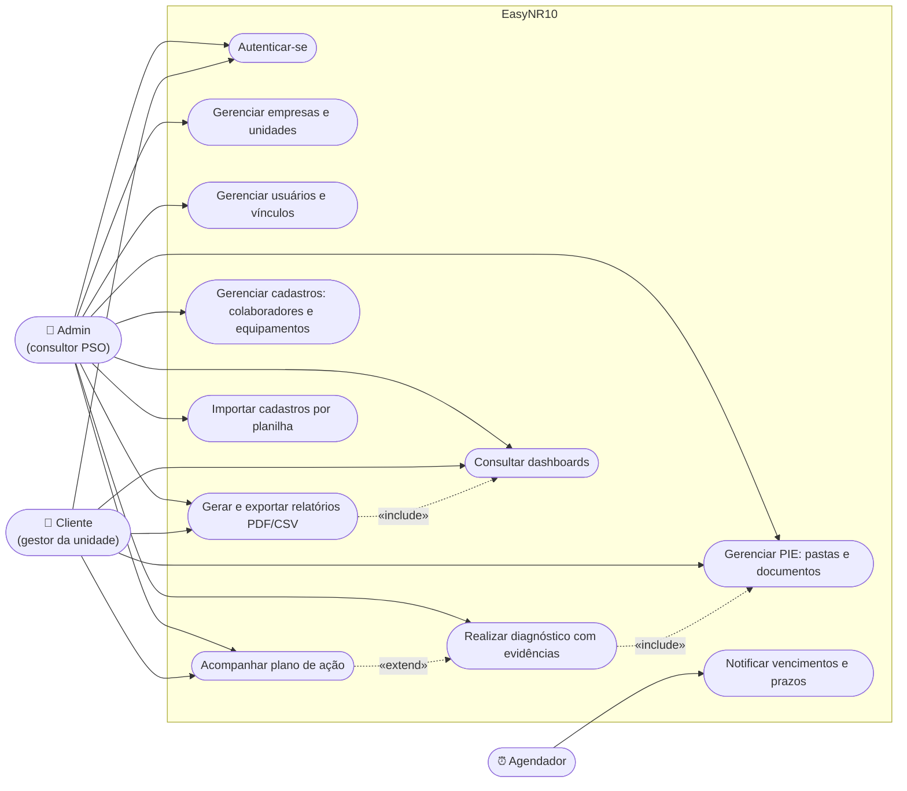
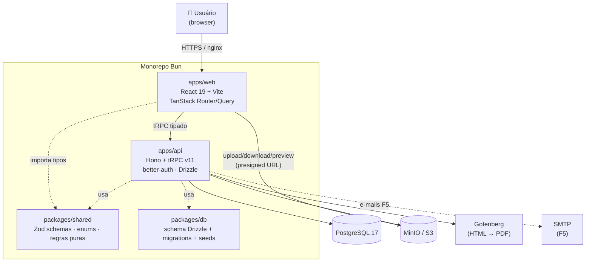
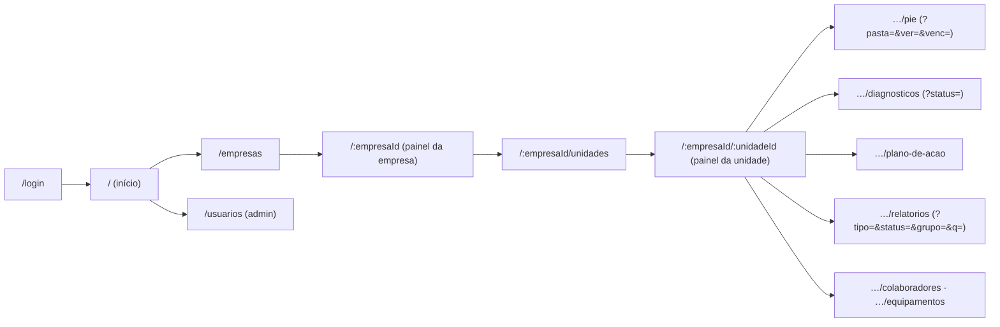
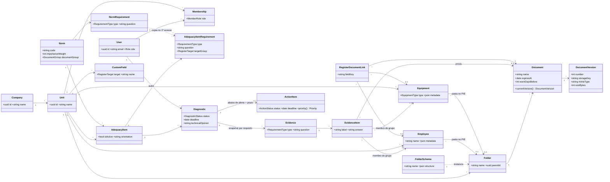
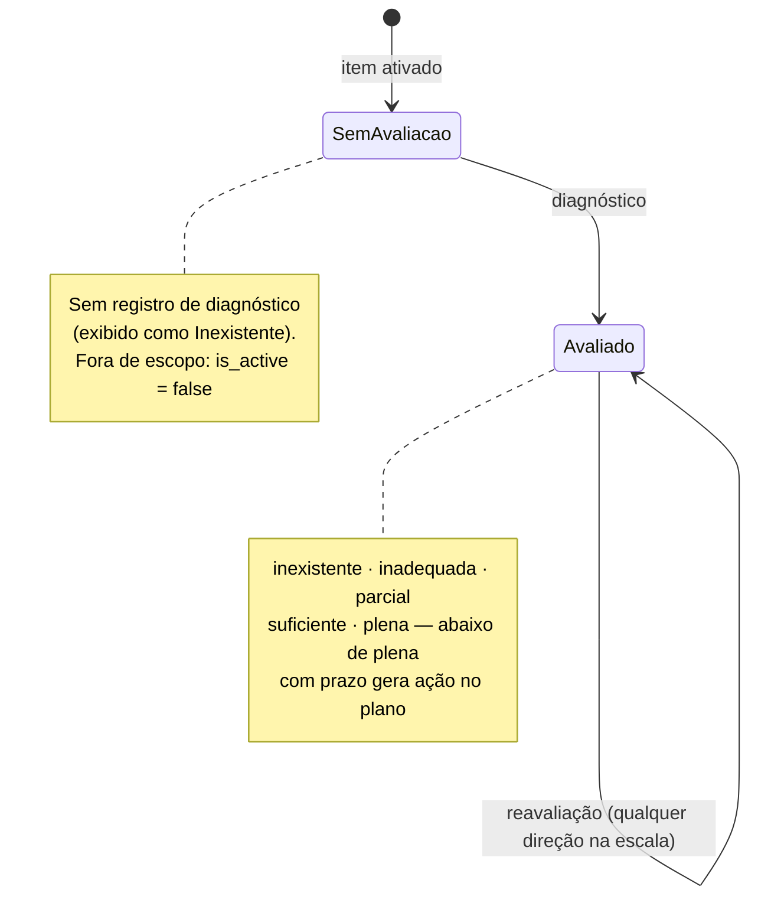
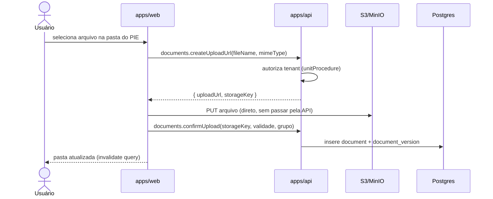
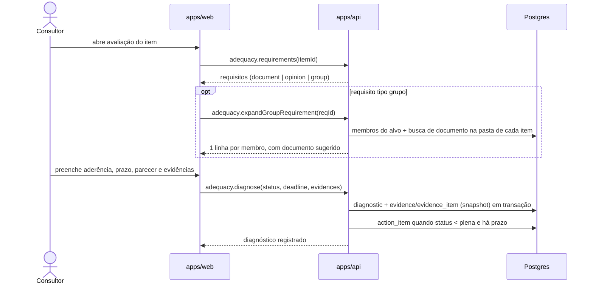

# EasyNR10 — Documento de Projeto

> Plataforma de gestão de conformidade com a **NR-10** da PSO Engenharia.
>
> **Versão:** 1.0 · **Atualizado em:** 04/07/2026 · **Status:** em desenvolvimento (F0–F4 entregues)

---

## 1. Visão geral

### 1.1 O produto

O **EasyNR10** é uma plataforma multi-tenant que a PSO Engenharia usa para conduzir e acompanhar a conformidade de seus clientes com a **NR-10** (Segurança em Instalações e Serviços em Eletricidade). Organizada por **empresa → unidade**, a plataforma cobre o ciclo completo da consultoria:

- o **PIE (Prontuário de Instalações Elétricas)** — a gestão documental exigida pela norma: árvore de pastas padronizada por esquemas, documentos com validade, versionamento imutável, preview e avisos de vencimento;
- a **avaliação de conformidade** — diagnósticos dos itens de adequação da unidade frente aos 90 requisitos catalogados da NR-10, com evidências estruturadas e parecer técnico;
- o **plano de ação** derivado das não conformidades, com prioridade calculada e acompanhamento de prazos;
- **cadastros** de colaboradores e equipamentos (elétricos, ferramentas, EPI, EPC) integrados ao PIE e ao motor de evidências;
- **dashboards** e **relatórios analíticos** exportáveis em PDF e CSV.

### 1.2 O problema

A conformidade NR-10 exige manter dezenas de documentos válidos por unidade (laudos, certificados, treinamentos, ASOs), avaliar periodicamente ~90 exigências normativas e comprovar cada avaliação com evidências. Sem sistema, esse controle vive em planilhas e pastas de rede: documentos vencem sem aviso, evidências se perdem e o cliente não tem visibilidade do próprio risco. O EasyNR10 centraliza esse fluxo e dá ao consultor e ao cliente a mesma fotografia da conformidade, em tempo real.

### 1.3 Atores

| Ator | Descrição |
|---|---|
| **Admin (consultor PSO)** | Gerencia empresas, unidades, usuários, catálogo de normas e esquemas de pastas; executa diagnósticos e emite pareceres técnicos |
| **Cliente (gestor da unidade)** | Acessa as unidades às quais pertence; consulta o PIE, envia documentos, acompanha plano de ação, dashboards e relatórios |
| **Sistema (agendador)** | Verifica vencimentos de documentos e prazos do plano de ação; dispara notificações in-app e e-mails *(fase F5)* |



## 2. Escopo

**Dentro do escopo (1.0):** autenticação (e-mail/senha + Google), gestão de empresas/unidades/usuários, PIE completo (esquemas de pastas, upload presigned, versões, validade, preview), catálogo de normas e requisitos, itens de adequação, diagnósticos com evidências, plano de ação com prioridade, cadastros de colaboradores/equipamentos com campos personalizados e importação por planilha, dashboards, relatórios com exportação PDF/CSV, notificações in-app e por e-mail.

**Fora do escopo (backlog):** API pública para terceiros, aplicativo móvel, outras NRs além da NR-10 (a modelagem por `norm` deixa a porta aberta), assinatura digital de documentos, SSO corporativo (SAML).

## 3. Requisitos

### 3.1 Requisitos funcionais

Prioridade MoSCoW: **M** (must) · **S** (should) · **C** (could). ✅ = entregue.

**Autenticação e acesso**
| ID | Requisito | Prior. | Status |
|---|---|---|---|
| RF01 | Login com e-mail/senha e com Google (OAuth2); sessão gerenciada pelo better-auth | M | ✅ |
| RF02 | Recuperação de senha por e-mail | M | pendente |
| RF03 | Perfis de acesso (admin, cliente) com permissões distintas, aplicadas no servidor | M | ✅ |
| RF03.1 | Criação de usuários pela UI (admin) e **papéis por unidade criáveis com mapeamento de permissões** (Gestor/Leitor do sistema + customizados) | M | ✅ |
| RF03.2 | **Painel de usuários por empresa**: lista só quem tem vínculo na empresa; cria usuário já vinculado às unidades escolhidas com papel da empresa; acessos gerenciados no escopo da empresa | M | ✅ |
| RF04 | Vínculo de usuários a unidades; usuário só enxerga empresas/unidades às quais pertence | M | ✅ |

**Estrutura organizacional**
| ID | Requisito | Prior. | Status |
|---|---|---|---|
| RF05 | CRUD de empresas | M | ✅ |
| RF06 | CRUD de unidades por empresa | M | ✅ |
| RF07 | Navegação por contexto empresa/unidade com a **URL como fonte da verdade** (filtros, ordenação e pasta atual compartilháveis por link) | M | ✅ |

**PIE — Prontuário de Instalações Elétricas**
| ID | Requisito | Prior. | Status |
|---|---|---|---|
| RF08 | Árvore de pastas por unidade a partir de esquemas padrão reaproveitáveis (gerador de estruturas) | M | ✅ |
| RF09 | Upload/download de documentos via presigned URL (S3) — a API não trafega binário | M | ✅ |
| RF09.1 | Todo novo upload sobre um documento existente cria uma **nova versão**, preservando as anteriores (histórico imutável) | M | ✅ |
| RF09.2 | Histórico de versões consultável: número, autor, data/hora e tamanho | M | ✅ |
| RF09.3 | Download de qualquer versão anterior | M | ✅ |
| RF09.4 | Restaurar versão anterior — a restauração cria uma nova versão apontando para o conteúdo antigo | S | ✅ |
| RF09.5 | **Preview** de documentos no navegador (PDF/imagem/texto inline; demais tipos caem no download) | S | ✅ |
| RF09.6 | Seleção de documento em qualquer tela via **modal com navegação de pastas**, iniciando na pasta do grupo quando houver contexto | S | ✅ |
| RF10 | Validade de documentos: data de expiração e antecedência de aviso configurável | M | ✅ |
| RF11 | Documentos referenciados vinculados aos grupos documentais exigidos pela norma (catálogo `default_document`) | S | parcial |

**Normas e conformidade**
| ID | Requisito | Prior. | Status |
|---|---|---|---|
| RF12 | Catálogo de normas/requisitos com peso de importância e grupo documental (90 normas + 101 requisitos seedados) | M | ✅ |
| RF13 | Itens de adequação por unidade × norma, ativáveis/desativáveis, com orientação própria da unidade | M | ✅ |
| RF13.1 | Configuração de **requisitos de evidência** por item: tipo (`documento`, `parecer`, `grupo`), pergunta, grupo-alvo e documento padrão de referência | M | ✅ |
| RF14 | Diagnóstico por item: aderência (escala de 5 níveis), prazo, responsável, ação recomendada, parecer técnico, autor | M | ✅ |
| RF15 | Evidências estruturadas por requisito: `documento` vincula documento do PIE; `parecer` registra resposta textual; `grupo` **expande os itens do cadastro-alvo** exigindo um documento por item | M | ✅ |
| RF15.1 | Sugestão automática de documento por item do grupo — busca na pasta do item no PIE pelo nome do documento padrão — com vínculo manual como alternativa | M | ✅ |
| RF16 | Plano de ação consolidado das não conformidades (aderência abaixo de `plena` com prazo), com **prioridade calculada** (seção 6.2) e acompanhamento de prazos | M | ✅ |
| RF17 | Importação de cadastros por planilha (Excel/CSV), com de-para de colunas e upsert por nome | S | ✅ |

**Cadastros**
| ID | Requisito | Prior. | Status |
|---|---|---|---|
| RF18 | Módulos de **Colaboradores** e **Equipamentos** por unidade, com campos default do sistema + **campos personalizados** por grupo-alvo | M | ✅ |
| RF18.1 | Equipamentos classificados por **tipo** (`elétrico`, `ferramenta`, `EPI`, `EPC`), cada tipo com estrutura própria de colunas | M | ✅ |
| RF18.2 | Cada item de cadastro tem **pasta correspondente no PIE**, criada automaticamente em estrutura fixa (`Colaboradores/Lista de Colaboradores/[nome]`, `Equipamentos/<Tipo>/Lista de <Tipo>/[nome]`), opcionalmente com esquema de subpastas | M | ✅ |
| RF18.3 | Campos **kind=document** (ex.: CA do EPI): código cadastrado + vínculo com documento do PIE (1 documento pode cobrir N itens) — base das automações de vencimento | S | ✅ |

**Visualização e relatórios**
| ID | Requisito | Prior. | Status |
|---|---|---|---|
| RF19 | Dashboard de conformidade por empresa (aderência por unidade) e por unidade (aderência geral, distribuição, grupos documentais, evolução no tempo, plano e documentos) | M | ✅ |
| RF20 | Aderência por grupo documental (instalações, instruções e procedimentos, colaboradores, equipamentos) | S | ✅ |
| RF21 | Relatórios analíticos: Não Conformidades, Situação Documental do PIE e Plano de Ação — com busca, filtros componíveis e ordenação por coluna | M | ✅ |
| RF22 | Exportação de qualquer relatório em PDF (apresentação) e CSV (dados), espelhando os filtros da tela | M | ✅ |

**Notificações** *(fase F5)*
| ID | Requisito | Prior. | Status |
|---|---|---|---|
| RF23 | Notificações in-app por usuário (lida/não lida, ativar/desativar) | S | pendente |
| RF24 | E-mails de vencimento de documento e prazo de ação, via agendador | M | pendente |

### 3.2 Requisitos não funcionais

| ID | Categoria | Requisito |
|---|---|---|
| RNF01 | Segurança | Hash de senha e sessões pelo better-auth; validação Zod estrita em toda entrada; nenhum segredo em repositório |
| RNF02 | Multi-tenancy | Toda query filtrada pelo contexto autorizado (`unitProcedure` no tRPC verifica admin ou membership da unidade); mesma checagem nas rotas HTTP |
| RNF03 | Auditoria | Soft-delete, `created_at`/`updated_at` e autoria em entidades de negócio; diagnósticos e versões de documento imutáveis (histórico completo) |
| RNF04 | Desempenho | Agregações no servidor; consultas reduzidas em memória apenas em volumes conhecidos (~90 itens/unidade); p95 de API < 300 ms nas consultas usuais |
| RNF05 | Upload | Arquivos direto ao S3 (presigned URL); API sem tráfego de binário |
| RNF06 | Testabilidade | Regras de negócio puras no pacote `shared` (testáveis por unit); fluxos críticos validados por e2e (Playwright) na stack Docker |
| RNF07 | Reprodutibilidade | Monorepo Bun com lockfile único; Docker multi-stage; migrations programáticas aplicadas no boot; seed de dev automática |
| RNF08 | Disponibilidade | Backup do Postgres e do bucket; migrations Drizzle como único mecanismo de mudança de schema |
| RNF09 | Usabilidade | pt-BR, responsivo, URLs compartilháveis, dark mode |
| RNF10 | Manutenibilidade | Identificadores em inglês / UI em pt-BR; componentes de UI únicos (pills, chips, tabs, dialogs); lint (oxlint) + typecheck em CI |

## 4. Arquitetura

### 4.1 Stack

| Camada | Tecnologia | Papel |
|---|---|---|
| Runtime | **Bun** (único — sem Node em nenhum ambiente) | Executa API, build do front e tooling |
| API | **Hono** sobre `Bun.serve` + **tRPC v11** | Roteador HTTP fetch-native fino; procedures tipadas ponta a ponta |
| Auth | **better-auth** | E-mail/senha + Google; sessões por cookie |
| Banco | **PostgreSQL 17** + **Drizzle ORM** | Persistência; migrations versionadas |
| Front | **React 19 + Vite + TanStack Router/Query** + **Tailwind 4** | SPA com URL como fonte da verdade; estado global mínimo (zustand só para contexto ativo e tema) |
| Storage | **MinIO / S3** (presigned URLs) | Documentos do PIE |
| PDF | **Gotenberg** | HTML → PDF na exportação de relatórios |
| Proxy | **nginx** | Serve o SPA e proxya `/api` |

### 4.2 Visão de containers



### 4.3 Organização do código (SRP por módulo)

```
apps/api/src/
  main.ts                 # Hono: CORS, auth, tRPC, export, health
  trpc.ts                 # procedures base (protected, unitProcedure)
  services/               # camada de dados/regras — routers e HTTP consomem daqui
    reports.ts            #   builders de relatórios/dashboards (RF19–RF22)
  routers/                # procedures tRPC por domínio
    adequacy/             #   composto por módulos: items, requirements,
                          #   diagnostics, actions (namespace adequacy.*)
    documents.ts folders.ts registers.ts reports.ts users.ts …
  report-export.ts        # rota HTTP GET /api/reports/export (CSV/PDF)
  s3.ts auth.ts env.ts cascade.ts

apps/web/src/
  pages/                  # uma página por rota — composição, sem lógica de UI duplicada
  components/
    ui/                   # primitivos ÚNICOS: pill, status-pill, filter-chips,
                          #   tabs (SegmentedTabs), sortable, dialog, row-menu…
    layout/               # sidebar (+ botão Novo), header, árvore do PIE, logo
    pie/                  # document-picker, upload, versões, preview, esquemas
    diagnostico/          # assessment-dialog (avaliação + evidências + histórico)
    registros/            # import-dialog (planilha)
  lib/                    # trpc, auth-client, format (datas/bytes pt-BR)
  stores/                 # contexto ativo (empresa/unidade), tema

packages/shared/src/      # contrato entre front e back
  enums.ts                # enums, labels, scores, faixas, actionPriority,
                          #   compareNormCodes, normalizeText, registerBasePath
  schemas.ts              # Zod schemas dos inputs de mutation
```

Convenções de dependência: **páginas → componentes → ui**; **routers → services → db**; regras de negócio puras (fórmulas, faixas, ordenação) vivem no `shared` e são a única fonte para front e back.

### 4.4 Navegação



Todos os filtros/ordenadores vivem na URL (`?ord=&dir=` padrão via `sortSearch`; status componível em CSV: `?status=inexistente,inadequada`). O botão **Novo** da sidebar navega com flags (`?nova=pasta|documento`, `?novo=1`) que a tela de destino consome para abrir o fluxo de criação.

## 5. Modelo de domínio

### 5.1 Diagrama de classes



### 5.2 Dicionário de dados

Convenções: **PK/FK/UK/NN** usuais; todas as tabelas de negócio têm colunas de auditoria `created_at`, `updated_at` e `deleted_at` (soft-delete, `NULL` = ativo), omitidas abaixo. Identificadores são `uuid` v7 (ordenáveis por tempo).

#### Tipos enumerados

| Enum | Valores | Uso |
|---|---|---|
| `user_role` | `admin`, `client` | Papel global do usuário |
| — | — | Papel na unidade virou entidade (`app_role`): papéis criáveis com mapeamento de permissões |
| `diagnostic_status` | `inexistente`, `inadequada`, `parcial`, `suficiente`, `plena` | Aderência do item à norma (escala de 5 níveis — seção 6.1). Item **sem diagnóstico** = "sem avaliação" (ausência de registro); item fora de escopo usa `adequacy_item.is_active = false` |
| `action_status` | `pendente`, `em_andamento`, `concluida`, `cancelada` | Situação da ação do plano |
| `requirement_type` | `document`, `opinion`, `group` | Tipo do requisito de evidência |
| `register_target` | `colaboradores`, `eletrico`, `ferramenta`, `epi`, `epc` | Alvo fixo dos requisitos tipo `group` e dos campos personalizados |
| `equipment_type` | `eletrico`, `ferramenta`, `epi`, `epc` | Tipo do equipamento |
| `document_group` | `instalacoes`, `instrucoes_e_procedimentos`, `colaboradores`, `equipamentos` | Grupos documentais do prontuário; classificam normas, documentos e o catálogo padrão |

#### `company` — empresa cliente

| Coluna | Tipo | Restrições | Descrição |
|---|---|---|---|
| `id` | uuid | PK | Identificador |
| `name` | varchar(255) | NN, UK | Nome da empresa |
| `logo_key` | varchar(512) | | Chave do logotipo no S3 |

#### `unit` — unidade da empresa

| Coluna | Tipo | Restrições | Descrição |
|---|---|---|---|
| `id` | uuid | PK | Identificador |
| `company_id` | uuid | FK → company, NN | Empresa dona |
| `name` | varchar(255) | NN, UK (company_id, name) | Nome da unidade |
| `logo_key` | varchar(512) | | Chave do logotipo no S3 |
| `email_config` | jsonb | | Configuração SMTP própria (F5) |

#### `user` — usuário

| Coluna | Tipo | Restrições | Descrição |
|---|---|---|---|
| `id` | uuid | PK | Identificador |
| `name` | varchar(255) | NN | Nome de exibição |
| `email` | varchar(255) | NN, UK | E-mail de login |
| `role` | user_role | NN, default `client` | Papel global |
| `notifications_enabled` | bool | NN, default `true` | Preferência de notificações |

> Credenciais (hash, contas Google, sessões, tokens) ficam nas tabelas do **better-auth**.

#### `app_role` — papel de acesso (mapeamento de permissões)

| Coluna | Tipo | Restrições | Descrição |
|---|---|---|---|
| `company_id` | uuid | FK → company | `NULL` = padrão do sistema (disponível em toda empresa, imutável); preenchido = papel customizado da empresa |
| `name` | varchar(120) | NN, UK (company_id, name) entre ativos | Nome do papel |
| `is_system` | bool | NN, default false | Gestor/Leitor são do sistema |
| `permissions` | jsonb | NN, default `[]` | Itens GRANULARES do catálogo `unitActionCatalog` (24 capacidades em 6 grupos, cada uma com rótulo e descrição): cada módulo tem a permissão de **leitura** (`*.ler` — sem ela o módulo some da navegação e responde 403 por link) e as de escrita (ex.: `pie.documento.enviar`, `diagnostico.avaliar`). Tela **Papéis** (por empresa) dá controle por item e mostra o mapeamento 1:1 com os endpoints do servidor (`users.permissionCatalog`) |

#### `membership` — vínculo usuário × unidade

| Coluna | Tipo | Restrições | Descrição |
|---|---|---|---|
| `unit_id` | uuid | PK, FK → unit | Unidade |
| `user_id` | uuid | PK, FK → user | Usuário |
| `role_id` | uuid | FK → app_role, NN | Papel do usuário nesta unidade |

#### `folder_schema` / `folder` — esquemas e pastas do PIE

| Coluna | Tipo | Restrições | Descrição |
|---|---|---|---|
| `folder_schema.name` | varchar(255) | NN | Nome do esquema (por unidade, copiado dos modelos globais no 1º uso) |
| `folder_schema.structure` | jsonb | NN | Árvore de pastas do modelo |
| `folder.unit_id` | uuid | FK → unit, NN | Unidade dona |
| `folder.parent_id` | uuid | FK → folder | Pasta pai (`NULL` = raiz) |
| `folder.name` | varchar(255) | NN, UK (unit_id, parent_id, name) | Nome |

#### `document` / `document_version` — documentos do PIE

| Coluna | Tipo | Restrições | Descrição |
|---|---|---|---|
| `document.folder_id` | uuid | FK → folder, NN | Pasta do documento |
| `document.current_version_id` | uuid | FK → document_version | Versão corrente |
| `document.name` | varchar(255) | NN | Nome de exibição |
| `document.document_group` | document_group | | Grupo documental (RF11) |
| `document.expires_at` | date | | Vencimento (`NULL` = não expira) |
| `document.warn_days_before` | int | | Antecedência do aviso (default 30) |
| `document_version.number` | int | NN, UK (document_id, number) | Sequencial |
| `document_version.storage_key` | varchar(512) | NN | Chave no S3 (`units/<unitId>/<uuid>/<nome>`) |
| `document_version.mime_type` | varchar(255) | NN | Tipo do arquivo |
| `document_version.size_bytes` | bigint | NN | Tamanho |
| `document_version.uploaded_by` | uuid | FK → user, NN | Autor do upload |

> Versões são **imutáveis** (sem `updated_at`/`deleted_at`); restaurar cria versão nova (seção 6.3). A árvore lógica de pastas vive só no banco — as chaves do S3 são desacopladas (mover/renomear não toca o storage).

#### `default_document` — catálogo global de documentos padrão

| Coluna | Tipo | Restrições | Descrição |
|---|---|---|---|
| `name` | varchar(255) | NN, UK (name, document_group) entre ativos | Nome padrão (30 seedados; sufixo `" - *"` = documento **por item**, o `*` vira o nome do alvo) |
| `document_group` | document_group | NN | Grupo documental |
| `is_optional` | bool | NN, default `false` | Opcional no prontuário |

#### `norm` / `norm_requirement` — catálogo da NR-10

| Coluna | Tipo | Restrições | Descrição |
|---|---|---|---|
| `norm.code` | varchar(50) | NN, UK | Código do item (ex.: `10.2.4`) — ordenação natural (`10.2` < `10.11`) |
| `norm.description` | text | NN | Texto do requisito |
| `norm.orientation` | text | NN | Orientação de adequação |
| `norm.importance_weight` | int | NN | Peso 1–4 no cálculo de conformidade (seção 6.1/6.2) — **nunca exibido na UI** |
| `norm.document_group` | document_group | | Grupo documental |
| `norm_requirement.type` | requirement_type | NN | Tipo de evidência (modelo) |
| `norm_requirement.question` | text | NN | Pergunta/exigência |

#### `adequacy_item` / `adequacy_item_requirement` — adequação por unidade

| Coluna | Tipo | Restrições | Descrição |
|---|---|---|---|
| `adequacy_item.unit_id` | uuid | FK → unit, NN, UK (unit_id, norm_id) | Unidade avaliada |
| `adequacy_item.norm_id` | uuid | FK → norm, NN | Norma aplicada |
| `adequacy_item.is_active` | bool | NN, default `true` | Item no escopo da avaliação |
| `adequacy_item.orientation` | text | | Orientação específica da unidade |
| `…requirement.type` | requirement_type | NN | Tipo exigido (copiado do catálogo no 1º acesso, editável) |
| `…requirement.question` | text | NN | Pergunta |
| `…requirement.target_group` | register_target | | Alvo expandido (obrigatório quando `type = group`) |
| `…requirement.default_document_id` | uuid | FK → default_document | Termo de busca da sugestão automática |

#### `diagnostic` / `evidence` / `evidence_item` — avaliação

| Coluna | Tipo | Restrições | Descrição |
|---|---|---|---|
| `diagnostic.adequacy_item_id` | uuid | FK, NN | Item avaliado |
| `diagnostic.author_id` | uuid | FK → user, NN | Consultor |
| `diagnostic.status` | diagnostic_status | NN | Aderência avaliada |
| `diagnostic.deadline` | date | | Prazo para adequação |
| `diagnostic.responsible` | varchar(255) | | Responsável na unidade |
| `diagnostic.recommended_action` | text | | Ação recomendada |
| `diagnostic.technical_opinion` | text | | Parecer técnico |
| `evidence.type` / `evidence.question` | | NN | **Snapshot** do requisito no momento do diagnóstico |
| `evidence_item.document_id` | uuid | FK → document | Documento-prova |
| `evidence_item.employee_id` / `equipment_id` | uuid | FK | Membro do grupo comprovado |
| `evidence_item.label` | varchar(512) | NN | Rótulo (ex.: "ASO de João Silva") |
| `evidence_item.answer` | text | | Resposta textual (tipo `opinion`) |

#### `action_item` — ação do plano

| Coluna | Tipo | Restrições | Descrição |
|---|---|---|---|
| `diagnostic_id` | uuid | FK, NN, UK | Não conformidade de origem |
| `status` | action_status | NN, default `pendente` | Situação |
| `deadline` | date | NN | Prazo |
| `completed_at` | timestamptz | | Conclusão efetiva |

#### `employee` / `equipment` / `custom_field` — cadastros

| Coluna | Tipo | Restrições | Descrição |
|---|---|---|---|
| `employee.name` | varchar(255) | NN, UK (unit_id, name) entre ativos | Nome do colaborador |
| `employee.folder_id` | uuid | FK → folder | Pasta no PIE (base da sugestão de evidência) |
| `employee.metadata` | jsonb | NN, default `{}` | Campos default (Função, Matrícula) + personalizados |
| `equipment.type` | equipment_type | NN | Tipo do equipamento |
| `equipment.metadata` | jsonb | NN, default `{}` | Campos default por tipo + personalizados (inclui o **código** dos campos kind=document, ex.: nº do CA) |
| `custom_field.target` | register_target | NN | Grupo-alvo do campo |
| `custom_field.name` | varchar(120) | NN, UK (unit_id, target, name) entre ativos | Nome (valor no `metadata` do item) |

#### `register_target_setting` — configuração do grupo-alvo

| Coluna | Tipo | Restrições | Descrição |
|---|---|---|---|
| `unit_id` | uuid | FK → unit, NN, UK (unit_id, target) entre ativos | Unidade dona |
| `target` | register_target | NN | Grupo configurado |
| `folder_schema_id` | uuid | FK → folder_schema | Estrutura de pastas **pré-selecionada** (opcional) ao criar itens do grupo |

#### `register_document_link` — vínculo campo → documento

| Coluna | Tipo | Restrições | Descrição |
|---|---|---|---|
| `document_id` | uuid | FK → document, NN | Documento do PIE (1 doc pode cobrir N itens) |
| `employee_id` / `equipment_id` | uuid | FK, UK (item, field_key) entre ativos | Item vinculado |
| `field_key` | varchar(120) | NN | Campo kind=document (ex.: `ca`) |

#### `notification` / `user_notification` — notificações (F5)

| Coluna | Tipo | Restrições | Descrição |
|---|---|---|---|
| `notification.title` / `body` | | NN | Conteúdo |
| `user_notification.read_at` | timestamptz | | `NULL` = não lida |

## 6. Regras de negócio

As regras puras vivem em `packages/shared/src/enums.ts` — única fonte para front e back.

### 6.1 Escala de aderência e aderência agregada

Cada diagnóstico avalia o item numa escala de **5 níveis** com scores fixos:

| Nível | Score |
|---|---|
| `inexistente` | 0% |
| `inadequada` | 25% |
| `parcial` | 50% |
| `suficiente` | 75% |
| `plena` | 100% |

O nível atual do item é o do **diagnóstico mais recente**. A **aderência agregada** (unidade, grupo documental ou empresa) é a média dos scores **ponderada pelo peso da norma** (`importance_weight`), considerando apenas itens ativos já avaliados. As faixas dão rótulo, emoji e frase de alerta (`adherenceBands`):

| Faixa | Rótulo |
|---|---|
| 0–20% | ❌ Inexistente |
| 21–40% | ⛔ Inadequada |
| 41–70% | ⚠️ Parcial |
| 71–90% | 🔷 Suficiente |
| 91–100% | ✅ Plena |



### 6.2 Prioridade do plano de ação

O peso da norma **não aparece na UI** — ele alimenta a prioridade da ação, calculada no servidor (`actionPriority`):

```
risco     = (nota_máx − nota) × peso        // nota 0–4 (escala), peso 1–4
amplitude = nota_máx × peso_máx = 16
percent   = 100 × (amplitude − risco) / amplitude
```

| Percent | Prioridade |
|---|---|
| 0–50% | 🔴 Alta |
| 51–90% | 🟡 Média |
| 91–100% | 🟢 Baixa |

A ação nasce automaticamente quando um diagnóstico abaixo de `plena` tem prazo; prazo vencido de ação pendente/em andamento é sinalizado em toda a UI.

### 6.3 Versionamento de documentos

1. **`document` é o registro lógico; `document_version` é o conteúdo.** O documento aponta para a versão corrente; cada versão tem seu `storage_key`, autor, tamanho e data.
2. **Histórico imutável**: novo upload cria a versão `n+1` e move o ponteiro — nada é sobrescrito.
3. **Restaurar = criar versão nova** reutilizando o `storage_key` da versão restaurada (a auditoria vê a restauração).
4. **Metadados no documento, conteúdo na versão**: validade, pasta e vínculos de evidência pertencem ao `document` — trocar versão não quebra evidências nem avisos.
5. **Exclusão é soft-delete** (o prontuário é registro legal).

### 6.4 Situação documental

Derivada de `expires_at` + `warn_days_before` (default 30): `vencido` (< hoje) · `a_vencer` (dentro da janela de aviso) · `em_dia` · `sem_validade`. Usada no PIE, nos relatórios, no dashboard e nos chips de vínculo dos cadastros.

### 6.5 Motor de evidências

1. **Configuração**: cada item de adequação recebe requisitos de evidência copiados do catálogo no primeiro acesso (contando excluídos, para não ressuscitar requisitos removidos) e ajustáveis por unidade — tipos `document`, `opinion`, `group`.
2. **Execução**: no diagnóstico, cada requisito preenchido vira uma `evidence`. Requisito `group` **expande os membros do alvo fixo** (colaboradores ou equipamentos de um tipo) — ex.: "ASO" sobre colaboradores gera um `evidence_item` por colaborador, cada um exigindo documento-prova.
3. **Sugestão automática**: como cada item de cadastro tem pasta no PIE, o sistema busca na subárvore da pasta pelo nome do documento padrão do requisito; o consultor confirma ou vincula manualmente pelo seletor com navegação de pastas.
4. **Snapshot**: a evidência copia tipo e pergunta do requisito no momento do diagnóstico — reconfigurar o item não altera diagnósticos passados.

## 7. Fluxos principais

### 7.1 Upload de documento (presigned URL)



### 7.2 Diagnóstico com evidências e plano de ação



### 7.3 Relatório com exportação

```mermaid
sequenceDiagram
    actor U as Usuário
    participant W as apps/web
    participant A as apps/api
    participant SV as services/reports
    participant G as Gotenberg

    U->>W: abre relatório (filtros na URL)
    W->>A: reports.nonConformities | documentsSituation | actionPlan
    A->>SV: builder do relatório
    SV-->>W: linhas tipadas
    U->>W: exportar
    W->>A: GET /api/reports/export?type&format&filtros (cookie de sessão)
    A->>SV: mesmo builder + mesmos filtros da tela
    alt CSV
        A-->>W: CSV (BOM UTF-8, ";" — Excel pt-BR)
    else PDF
        A->>G: HTML A4 paisagem → PDF
        A-->>W: PDF
    end
```

## 8. Segurança e multi-tenancy

- **Autorização no servidor, sempre**: `unitProcedure` (tRPC) valida sessão + admin/membership da unidade e carrega no contexto as **permissões do papel** do membro (`app_role`); queries e mutations usam `unitAction('<ação>')`, que exige a ação GRANULAR no papel (catálogo de 24 capacidades com descrição — `unitActionCatalog`; leituras `*.ler` por módulo). A rota HTTP de exportação repete a checagem de membership. Buscar entidade sempre passa pelo filtro de tenant.
- **Papéis por unidade**: cada membership tem um papel; Gestor (tudo) e Leitor (só leitura) são do sistema, e o admin pode criar papéis com qualquer combinação das ações. A matriz completa (permissão + ação por endpoint) é gerada por `bun run permissions` → `PERMISSOES.md`.
- **Visibilidade organizacional** centralizada em `services/visibility.ts` (`visibleUnits`/`canAccessCompany`) — nada de branch por papel dentro das rotas.
- **Sessões** por cookie (better-auth); CORS restrito ao front com `credentials`.
- **Uploads/downloads** por presigned URL de curta duração (10/5 min) — a API nunca vê o binário; endpoint público do S3 distinto do interno.
- **Validação** Zod em todos os inputs (schemas compartilhados no `shared`).
- **Soft-delete + autoria** nas entidades de negócio; versões e diagnósticos imutáveis.
- Nenhum segredo no repositório: `.env` gitignored em dev, secret manager em produção.

## 9. Infraestrutura e operação

- **Dev**: `docker compose up -d --build` sobe a stack completa (web+nginx, api, postgres, minio, gotenberg, mailpit); `docker-compose.dev.yml` sobe só a infra para rodar api/web com hot reload no host. Config central no `.env` (portas e credenciais com defaults).
- **Runtime**: 100% Bun — imagens `oven/bun` (o wrapper `node`→bun da imagem cobre CLIs com shebang node); scripts de vite/drizzle-kit usam `bunx --bun`. Não há dependência de Node em nenhum ambiente.
- **Migrations**: programáticas (`packages/db/src/migrate.ts`), aplicadas no boot do container da API; geradas por `drizzle-kit generate`.
- **Seeds**: catálogo NR-10 (90 normas + 101 requisitos), 30 documentos padrão e dados de desenvolvimento.
- **CI (alvo)**: lint (oxlint) → typecheck → build; e2e Playwright nos fluxos críticos.
- **Backups**: Postgres + bucket versionado.

## 10. Qualidade

1. Todo requisito implementado com autorização de tenant verificada no servidor.
2. Regras de negócio puras no `shared` (unit-testáveis); fluxos críticos (login, upload, diagnóstico, exportação) validados por e2e na stack Docker.
3. Lint + typecheck limpos.
4. UI em pt-BR, navegável por URL, responsiva, dark mode.
5. Componentes de UI únicos (pill/chips/tabs/dialog/sortable) — nada de estilos inline duplicados por página.

## 11. Roadmap

| Fase | Entrega | Conteúdo | Status |
|---|---|---|---|
| F0 | Fundação | Monorepo, auth, contexto de tenant, navegação | ✅ |
| F1 | Núcleo organizacional | Empresas, unidades, usuários/vínculos | ✅ |
| F2 | PIE | Esquemas de pastas, upload presigned, versões, validade, preview | ✅ |
| F3 | Conformidade | Catálogo, itens de adequação, diagnósticos, evidências, plano de ação | ✅ |
| F3.5 | Cadastros | Colaboradores/Equipamentos, campos personalizados, importação, vínculos de documento | ✅ |
| F4 | Visualização | Dashboards, relatórios, exportação PDF/CSV | ✅ |
| F5 | Notificações | In-app + e-mails agendados (vencimentos e prazos) | pendente |
| F6 | Automações | Vencimento dos campos kind=document → alertas/diagnóstico; `referenced_document` (RF11) | pendente |

## 12. Riscos

| Risco | Prob. | Impacto | Mitigação |
|---|---|---|---|
| Regra de conformidade divergir do entendimento do consultor | Média | Alto | Regras puras centralizadas no `shared` + validação com a PSO a cada entrega |
| Crescimento do volume documental degradar listagens | Baixa | Médio | Agregações no servidor; paginação onde o volume justificar |
| Vencimentos passarem despercebidos até F5 | Média | Médio | Situação documental visível em PIE/dashboard/relatórios desde F2 |
| Escopo crescer durante o desenvolvimento | Alta | Médio | Backlog separado; fases fechadas por critério de saída |
